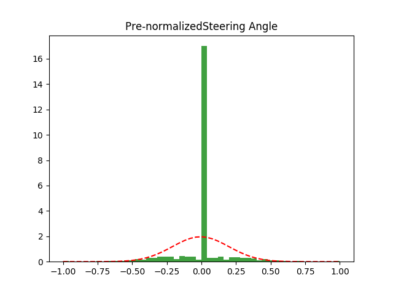
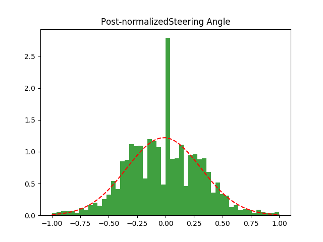
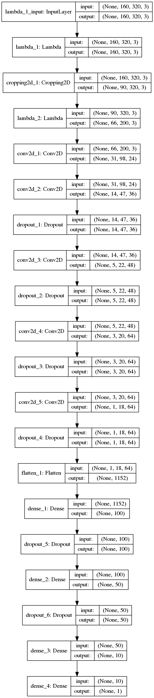

# **Behavioral Cloning** 

The goals / steps of this project are the following:

* Use the simulator to collect data of good driving behavior
* Build, a convolution neural network in Keras that predicts steering angles from images
* Train and validate the model with a training and validation set
* Test that the model successfully drives around track one without leaving the road
* Summarize the results with a written report


## Rubric Points
### Here I will consider the [rubric points](https://review.udacity.com/#!/rubrics/432/view) individually and describe how I addressed each point in my implementation.  

---
### Files Submitted & Code Quality

#### 1. Submission includes all required files and can be used to run the simulator in autonomous mode

My project includes the following files:

* [**model.py**](https://github.com/stridera/CarND-Behavioral-Cloning-P3/blob/master/model.py) containing the script to create and train the model
* [**drive.py**](https://github.com/stridera/CarND-Behavioral-Cloning-P3/blob/master/drive.py) for driving the car in autonomous mode
* [**preprocess.py**](https://github.com/stridera/CarND-Behavioral-Cloning-P3/blob/master/preprocess.py) has some ideas I had about preprocessing the images
* **model.h5** containing a trained convolution neural network 
* **writeup.md** summarizing the results... the file you're reading!


#### 2. Submission includes functional code
Using the Udacity provided simulator and my drive.py file, the car can be driven autonomously around the track by executing 
```sh
python3 drive.py model.h5
```

#### 3. Submission code is usable and readable

The model.py file contains the code for training and saving the convolution neural network. The file shows the pipeline I used for training and validating the model, and it contains comments to explain how the code works.

### Model Architecture and Training Strategy

My model was built using Keras 2.  It's based on the model shown during the class.  

#### 0. Get the data ready to pass through the CNN.

The first steps I took (lines 98-100) involve preparing the data for the rest of the CNN.  The first step was to normalize the image to make it easier for the network to identify edges.  Next we crop the top (trees and sky) and the bottom (hood of the car).  Finally I resize the image back up to help stretch it out and make turns easier to identify.

#### 1. An appropriate model architecture has been employed

My model consists of a convolution neural network with 5x5 filter sizes, going in strides of 2 in each direction, and depths between 24 and 64.  I use a relu activation all throughout this process.  As I hit a depth of 64, I run it through a couple times with a 3x3 window.

Next I flatten the layer and run it through a couple dense fully connected layers to bring it from 100 outputs to 1, the steering of the car.

#### 2. Attempts to reduce overfitting in the model

The model contains dropout layers to drop 20% at each layer in order to reduce overfitting.  I also have some preprocessing tuning to help prevent the tendency for the car to drive straight (off a cliff.)  I discuss this more in the training strategy section below.


#### 3. Model parameter tuning

The model used an adam optimizer, so the learning rate was not tuned manually ([model.py:141](https://github.com/stridera/CarND-Behavioral-Cloning-P3/blob/master/model.py#L141)).

#### 4. Appropriate training data

Training data was chosen to keep the vehicle driving on the road. I took an approach of training a bunch of situations and then combining them on the fly before each training session to see what works best.  I then mix and matched by merging the driving csv file with whatever section I wanted.

### Model Architecture and Training Strategy

#### 1. Solution Design Approach

I followed the design approach laid out in the Behavioral Cloning section in Udacity.  This approach was easy to understand and Keras worked well.  It allowed me to easily try new steps easily and didn't require me to keep track of input sizes throughout the framework.  (A huge plus.)

My first concern was that the majority of the training data involved the car just moving forward.  I tried to include a lot of small minor adjustments while training, but there was still an inordinate amount of driving straight.  To prevent the model from preferring to drive straight (off the road) instead of turning, I used pandas to create a sample of 90% of all straight driving (steering==0) and drop them.  (Seen in the Load Data function, [model.py:20](https://github.com/stridera/CarND-Behavioral-Cloning-P3/blob/master/model.py#L15).)

You can see the different in distribution here:
 

90% seemed to work well and still kept enough straight angles to keep the car running smoothly on the straight sections, with enough spread to catch the turns.

I also took the suggestion of flipping each other frame (and negating the steering measurements) to prevent it from preferring one direction over another.

#### 2. Final Model Architecture

You can see the final model at [model.py:93-118](https://github.com/stridera/CarND-Behavioral-Cloning-P3/blob/master/model.py#L93). 

The model is built using a Keras sequential layer.  The steps are the lambda for normalization, the image cropping, and the next lambda for stretching it back out.  Next we have a typical CNN where we build it up, and then run it through the fully connected layer to get our result.

Here is a visualization of the model:


#### 3. Creation of the Training Set

Finally, I had to spend a lot of time driving around the track to get training data.  As I mentioned before, I learned early that the training data overwrote everything in the same directory when you restart the simulator.  This also meant that it was difficult to try one set and then add to it by saving to the same folder.  My solution was to create multiple folders of different techniques.  As mentioned above, I ended up with the following folders:

* Center driving for 2 laps
* Starting at the edge and driving to the center
* Just the bridge
* Driving in reverse
* weaving back and forth from edge to edge

In the end, I ended up using only the center driving, the bridge, and recovering to center data sets.  Adding more seems to bias it toward the edges and I would randomly drive off the road.

#### 4. Training the model

I train the model at [model.py:141](https://github.com/stridera/CarND-Behavioral-Cloning-P3/blob/master/model.py#L141)

I train the model using 20% as validation data and 2 epochs.  I found that if I run it through too many epochs, the accuracy appears to go down when I test it.  Two seems to be perfect for getting a model that runs well and stays on the road.  I used an adam optimizer so that manually training the learning rate wasn't necessary.

#### 5. Finale Run
The final run seemed to go well.  It made me worry around some turns, but it corrected well.  At first it would break every time it hit the bridge, but adding the bridge training data made it so it handles it smoothly.

Here is a video of the final run:
[](http://www.youtube.com/watch?v=xETRU1RBfjk)

### Failed Approaches

#### 1. Attempt to map from forward view to top down
My first approach was to setup a generator (seen at [model.py:127](https://github.com/stridera/CarND-Behavioral-Cloning-P3/blob/master/model.py#L127)) that would take each image and perform some preprocessing steps (Seen at [model.py:63](https://github.com/stridera/CarND-Behavioral-Cloning-P3/blob/master/model.py#L63))
The original idea was to skew the image to stretch the top.  (Translate to make it look like it was top down.)  I thought this would make it easier to identify the turns and react to them.  However, I realized that the generator happens outside the model, so by training it on this data it would effectively make it not able to respond to data passed via the simulator.  I realized that I could add a lambda layer to do the same thing, but by the time I considered this I had a working model and didn't want to worry about breaking it.

You can view the code I used to process this code and visualize it inside [preprocess.py](https://github.com/stridera/CarND-Behavioral-Cloning-P3/blob/master/preprocess.py).  One good step I discovered was creating a video with the original image on top and the processed image on the bottom.  It was easier to understand and view along the whole track than it was to view single images.
